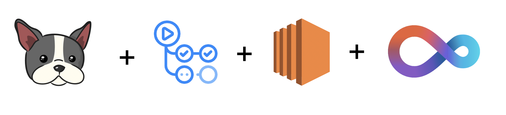
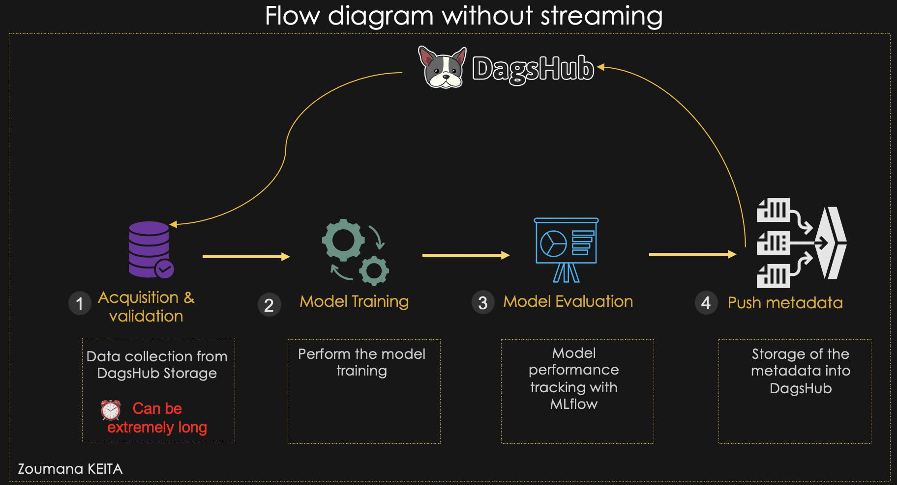
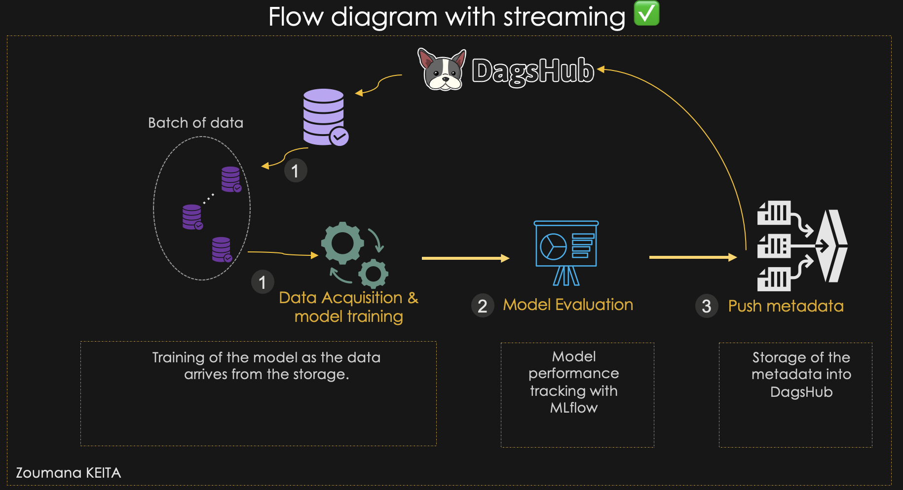
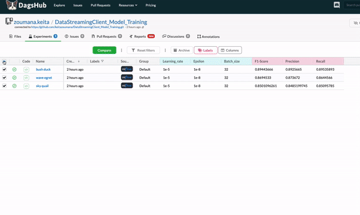
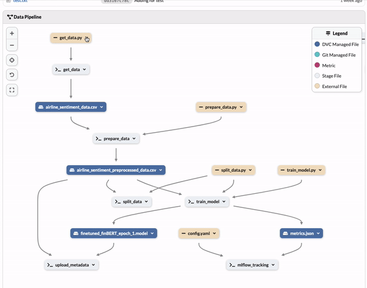

# How to improve your model training with DagsHub Streaming Client on EC2 instance.   

  

## Main Concepts Covered 
After completing this repository, you will be able to understand the following concepts: 
- Provision an [AWS EC2](https://aws.amazon.com/fr/ec2/) and running the training of a [BERT](https://huggingface.co/docs/transformers/model_doc/bert) model  with [CML](https://cml.dev/)
- Apply DagsHub Streaming Client to improve your training process. 
- Implement a Github actions pipeline using the previous instance. 
- Automatically log your models metrics with [MLFlow](https://mlflow.org/).    
- Compare the model performance with MLflow Experiment. 
- Automatically save your training metadata on [DVC](https://dvc.org/) for easy tracking.  

## Workflow Comparison: Streaming Vs. Regular Approach

###  Regular Approach 
This approach can take significant amount of time to get the data from pull instruction. 

  

###  Streaming Approach 
Streaming simplifies the complexity of data collection by introducing a parallel computation approach, which starts the model training while getting the data from the storage. 

  

# Getting started  
### 1. Prerequisites
#### Platforms 
##### AWS EC2 instance properties   
A free tier is enough for this use case. Below are the properties of the EC2 instance used for the use case. 
- cloud type: t2.micro. 
- cloud-region: us-east-1a

##### Other platforms
- Access to [DagsHub](https://dagshub.com/)
- Access to [GitHub Actions](https://github.com/features/actions)

#### Other ressources
- Python 3.9.1 
- DVC 2.11  
- CML 
- You can find all the additional information in the `requirements.txt` file

## Results On DagsHub
DagsHub provides the capabilities to use MLFlow and DVC while giving the choice of working on Github. The following results are the experiments from DagsHub, using MLFlow to track the model `F1-Score`, `Precision` and `Recall`.

### MLFlow metrics for each epoch. 
The following graphics shows the performances of the models for 3 epochs. 

  

### General workflow 
Below is the general workflow of the pipeline. 

  

## Full Article Coming Soon On Medium 
